
<h1 align="center">基于SSM框架的宿舍管理系统的设计与实现+jsp</h1>

## 简介
宿舍管理系统：角色分为管理员、学生；功能包括学生管理、宿舍信息管理、维修登记、评分管理、来访登记、公告管理、系统设置等模块。    --计算机毕业设计源码；毕设源码；java毕业设计源码

## 联系方式

<h3 align="center">获取完整代码与数据库文件 + 微信：deepguan QQ: 86050149 QQ群: 783742310</h3>

<h3 align="center">可帮忙远程部署 包运行成功！提供远程部署、修改代码、设计文档指导、代码讲解等服务！</h3>

## 功能介绍（完整见运行截图）
管理员：管理员可以通过登录界面进入系统，并拥有管理学生信息、班级信息和宿舍信息的权限。主要功能包括添加、修改和删除学生、班级及宿舍的具体信息，以及处理宿舍维修登记和评分管理。同时，管理员能够编辑和发布公告，通过系统管理功能对整个系统的模块及用户权限进行调整和维护。此外，管理员还有权限查询和管理来访人员信息，确保宿舍的安全管理。

学生：学生可以通过系统登录界面进入个人中心，可以查看和更新个人信息，包括学号、姓名、宿舍号及联系方式等。学生还能查看宿舍评分管理及其结果，参与宿舍卫生和文明行为的评分。访问时，学生可以查看其所属班级信息和宿舍成员，并对自己在系统中的评价和数据进行查看和反馈。该系统为学生提供了一个便捷的平台来参与宿舍管理和自我信息维护。

## 运行截图
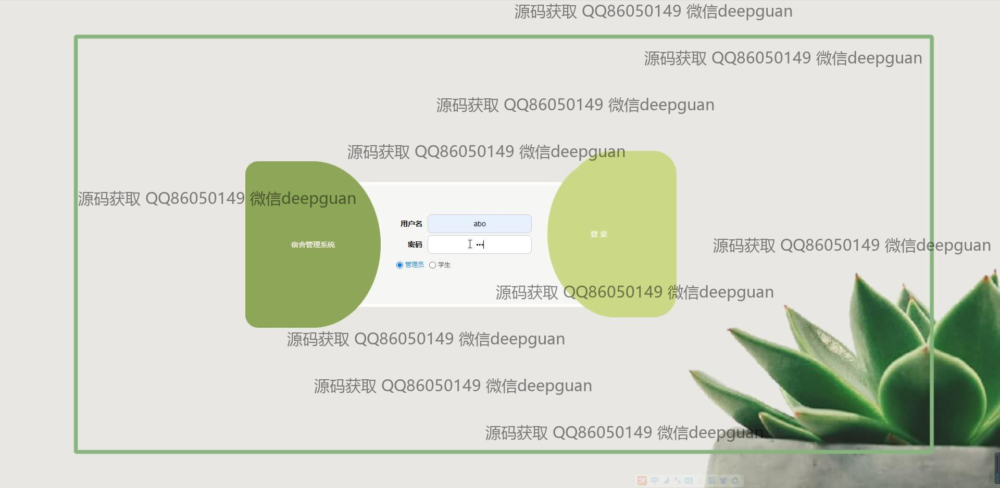

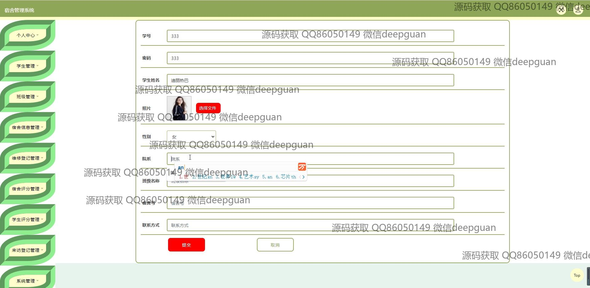
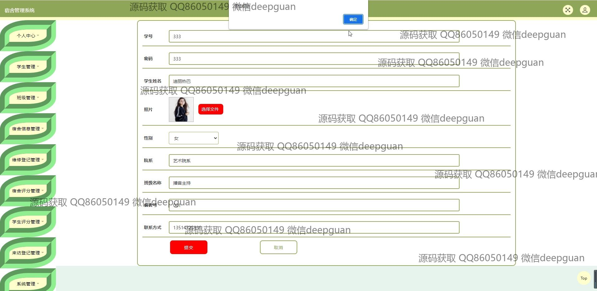
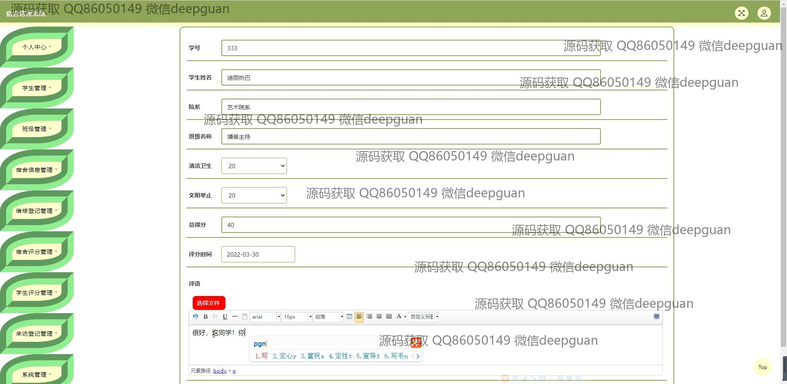
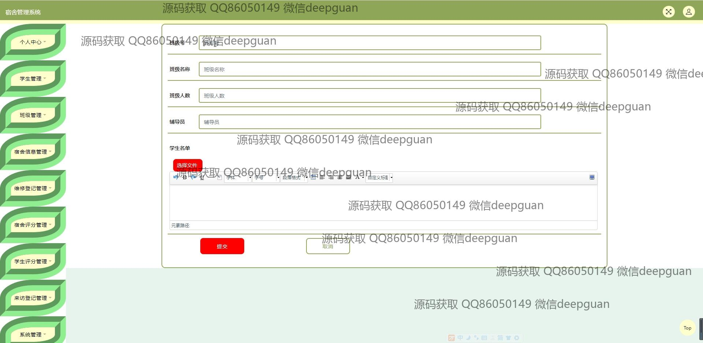
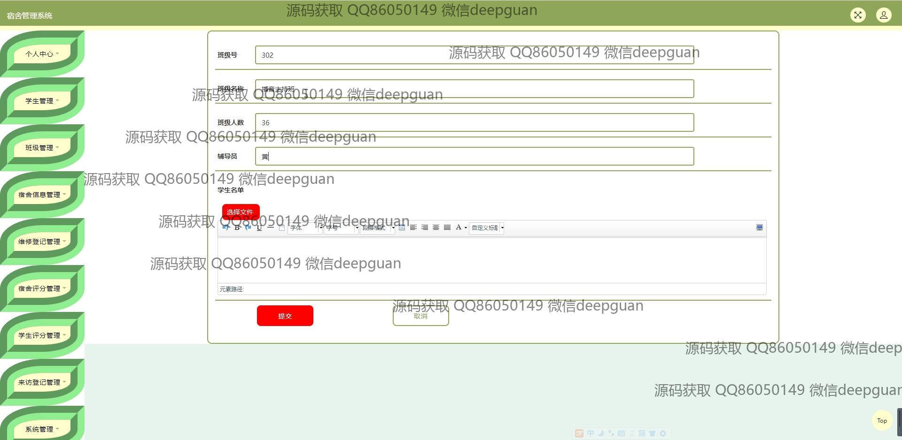
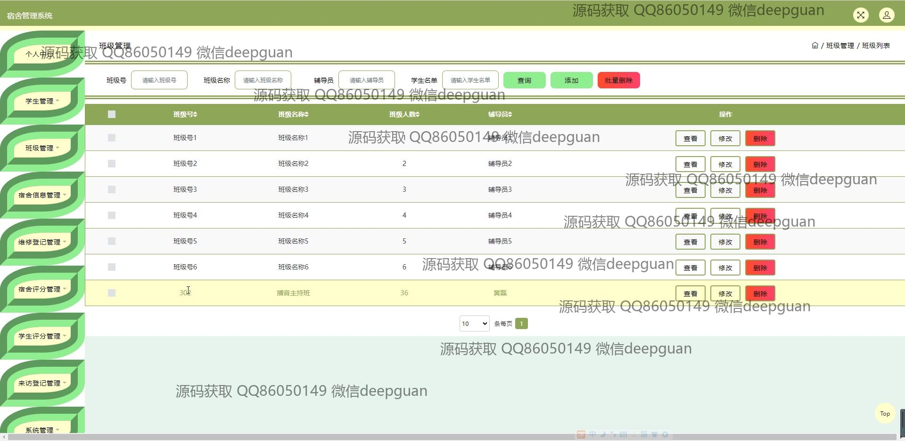
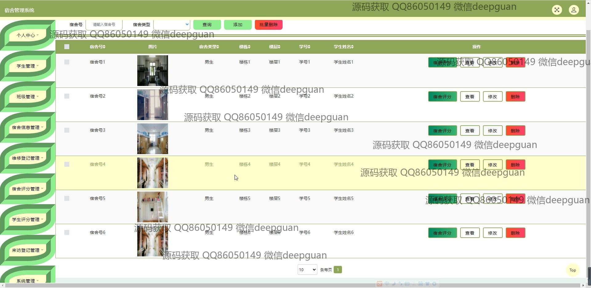
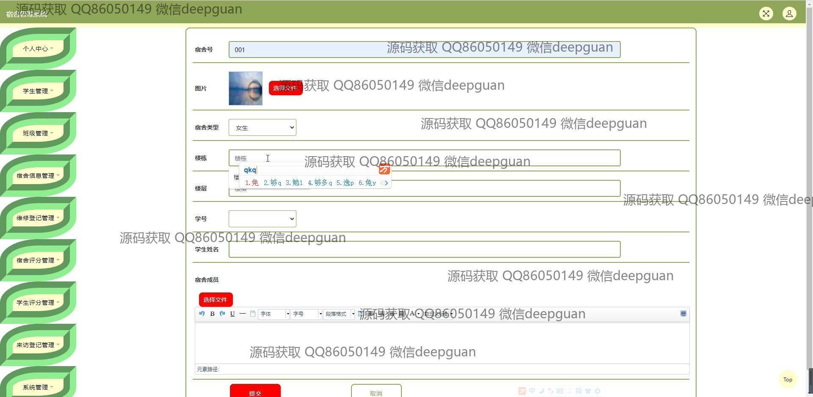
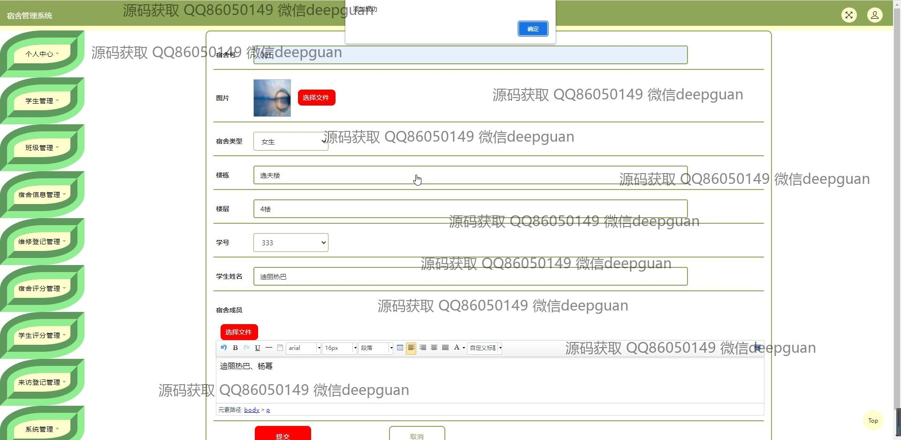
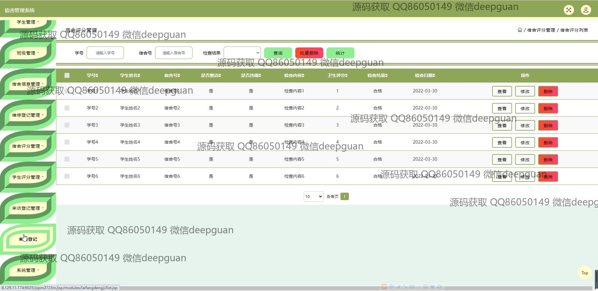
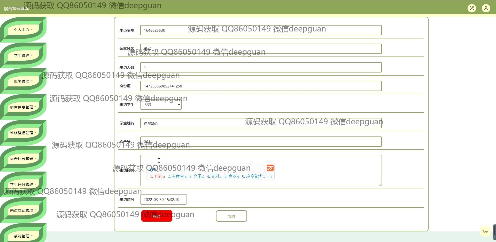
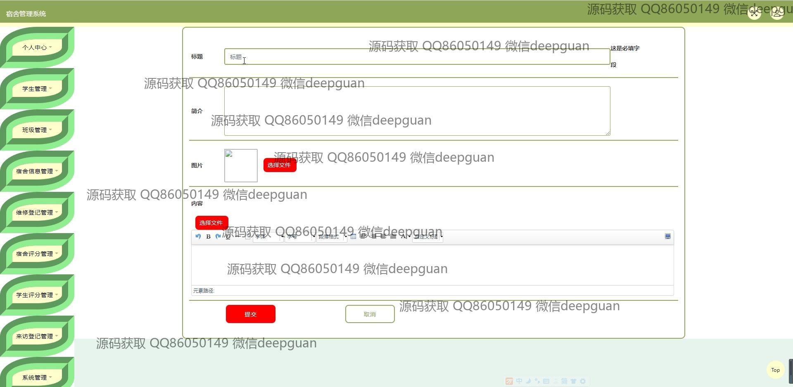
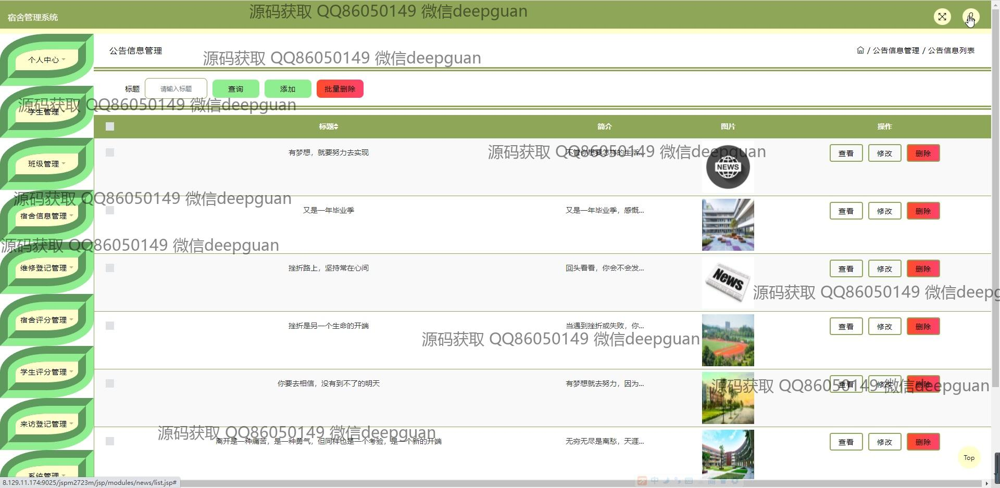
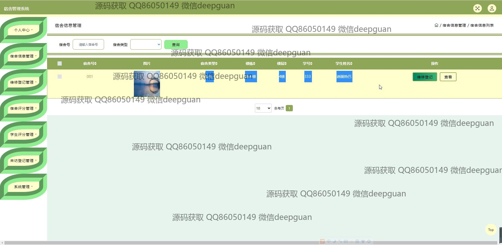
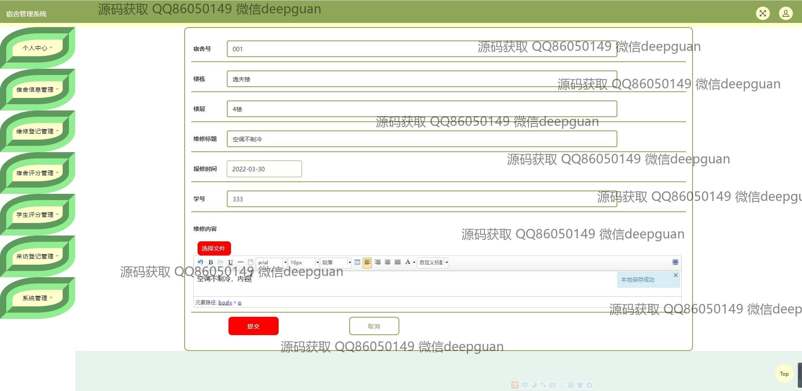
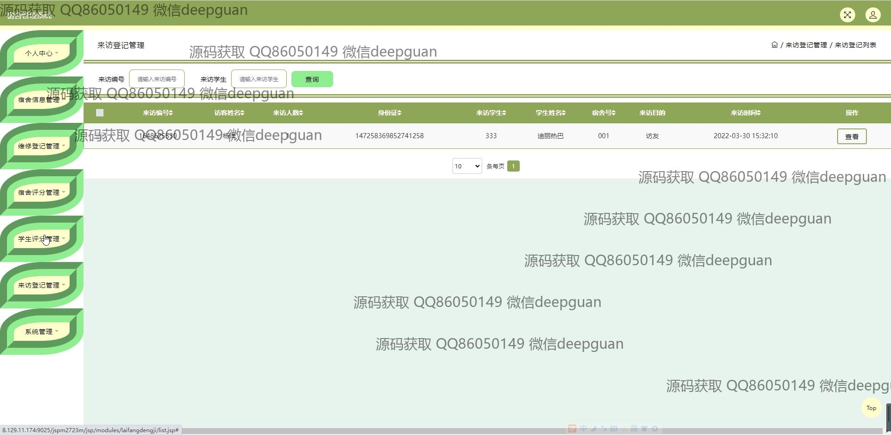
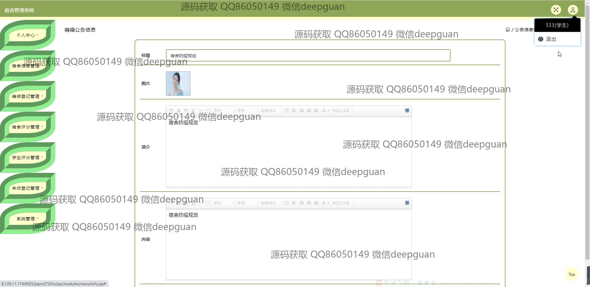
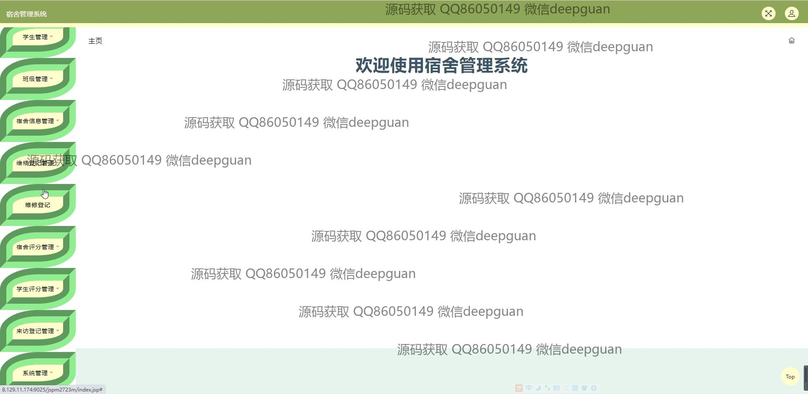
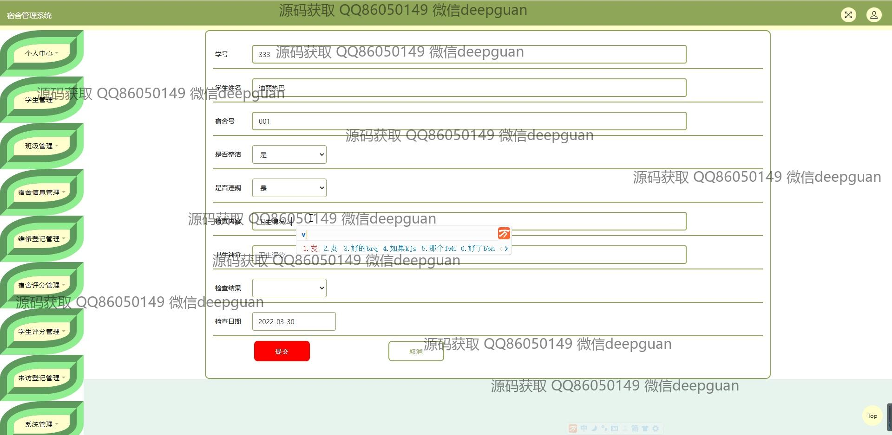
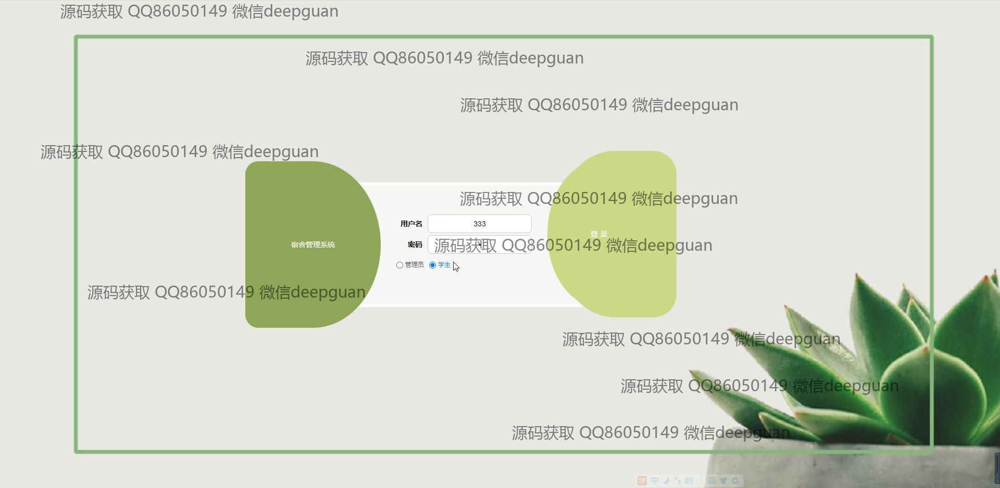

本代码来源于网络,仅供学习参考使用!

